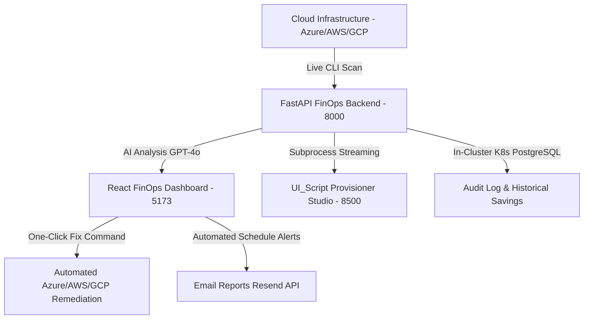

# 🏆 AI Cloud Cost Detective & FinOps Intelligence Platform
## Ultimate Enterprise Mega Master Blueprint & Operations Manual

> **Document Type**: Definitive Enterprise Mega Master Manual (Executive, Architecture, DevOps & Operations)  
> **Consolidates**: Executive Master Guide, DevOps Deployment Blueprint, Pre-Deployment Checklist, UI_Script Provisioner Studio, and `docs/` Index  
> **Prepared For**: Senior Managers, Directors, VP of Infrastructure, CTO, CISO, CIO, and Lead Cloud Engineers  
> **Target Cloud Providers**: Azure AKS, AWS EKS, GCP GKE  
> **Document Version**: 7.0 (Multi-Cloud UI Studio & Unified Microservices Edition)  
> **System Status**: 🟢 Active, Fully Operational & Production Ready  

---

## 📋 Mega Master Table of Contents
1. [Executive Briefing & Business Value ROI (C-Suite Pitch)](#1-executive-briefing--c-suite-pitch)
2. [Enterprise Problems Solved Matrix](#2-enterprise-problems-solved-matrix)
3. [System Architecture & 3-Tier Microservices Stack](#3-system-architecture--3-tier-microservices-stack)
4. [Multi-Cloud Provisioner Studio (`application/UI_Script`)](#4-multi-cloud-provisioner-studio-applicationui_script)
5. [How the Platform Works Under-the-Hood (6-Stage Pipeline)](#5-how-the-platform-works-under-the-hood-6-stage-pipeline)
6. [Core Platform Features & 15-Item Paginated History](#6-core-platform-features--15-item-paginated-history)
7. [Step-by-Step Manager & C-Level Live Demonstration Script](#7-step-by-step-manager--c-level-live-demonstration-script)
8. [Pre-Deployment Prerequisites & Setup Checklist](#8-pre-deployment-prerequisites--setup-checklist)
9. [Local Stack Execution & Dockerization (`start_local.sh`)](#9-local-stack-execution--dockerization-start_localsh)
10. [Multi-Cloud Modular Terraform Architecture (Azure, AWS, GCP)](#10-multi-cloud-modular-terraform-architecture-azure-aws-gcp)
11. [In-Cluster Kubernetes PostgreSQL Database & Traefik Ingress](#11-in-cluster-kubernetes-postgresql-database--traefik-ingress)
12. [Observability & Monitoring Stack (Prometheus + Grafana + Loki)](#12-observability--monitoring-stack-prometheus--grafana--loki)
13. [One-Click Automated Deployment Script Suite (`deploy.sh`)](#13-one-click-automated-deployment-script-suite-deploysh)
14. [GitHub Actions CI/CD & ArgoCD GitOps Integration](#14-github-actions-cicd--argocd-gitops-integration)
15. [Complete Multi-Cloud `docs/` Reference Directory](#15-complete-multi-cloud-docs-reference-directory)
16. [Complete API Endpoints Reference Matrix](#16-complete-api-endpoints-reference-matrix)
17. [Executive Q&A (Preparing for Leadership Questions)](#17-executive-qa-preparing-for-leadership-questions)

---

## 1. Executive Briefing & C-Suite Pitch

### 💡 What is AI Cloud Cost Detective?
**AI Cloud Cost Detective** is an enterprise-grade **Cloud Financial Management (FinOps) and Infrastructure Governance Platform** designed for Microsoft Azure, AWS, and GCP multi-cloud Kubernetes environments.

It autonomously scans cloud subscriptions, detects **idle virtual machines**, **unattached managed disks**, **orphaned public IPs**, and **tagging governance violations**, providing real-time AI-driven cost recommendations alongside **one-click executable CLI remediation commands**.



### 📈 Business ROI & Financial Value Impact
- **Immediate Cost Reduction**: Automatically identifies **20% to 40% monthly waste** in cloud compute, storage, and networking.
- **Zero Friction One-Click Fixes**: Eliminates manual portal searching by generating exact `az` / `aws` / `gcloud` CLI remediation commands ready for instant execution.
- **Audit-Ready Compliance**: Maintains an immutable remediation audit log recording every fix command, timestamp, engineer email, and dollar savings achieved ($ Saved to Date).
- **In-Cluster Cost Efficiency**: Runs **100% inside Kubernetes** (Frontend, Backend, UI_Script, and PostgreSQL StatefulSet)—saving thousands of dollars in cloud-managed service fees.

---

## 2. Enterprise Problems Solved Matrix

| Enterprise Problem | Industry Risk / Pain Point | AI Cloud Cost Detective Solution |
| :--- | :--- | :--- |
| **Zombie Cloud Waste** | Stopped VMs, unattached Managed Disks, and unused Public IPs continue incurring monthly charges. | Scans live resource states (`diskState: Unattached`, `isAssociated: false`) and recommends immediate deallocation/deletion. |
| **Missing Governance Tags** | Lack of `Department`, `Environment`, and `CostCenter` tags prevents accurate cloud budget allocation. | Categorizes all resources into **Tag-Based Cost Allocation Cards** and detects **Untagged Violations** automatically. |
| **Infrastructure Drift** | Configuration drift between baseline IaC templates and actual deployed cloud state. | Features a real-time **Infrastructure Drift & Policy Monitor** with automated remediations. |
| **Delayed Cost Visibility** | Cloud bills arrive 30 days late, leaving IT leadership with unpredicted spending spikes. | Real-time scan and **Automated Email Scheduling** (Daily/Weekly/Monthly alerts) push reports to managers proactively. |
| **Multi-Cloud Provisioning Complexity** | Difficulty setting up test environments with realistic FinOps workloads. | Integrated **UI_Script Provisioner Studio** (`http://localhost:8500`) provisions 12 resources per environment across Azure, AWS, and GCP. |

---

## 3. System Architecture & 3-Tier Microservices Stack

The system follows a modern, decoupled **3-tier Microservices architecture**:

```
+-----------------------------------------------------------------------------------+
|                            TRAEFIK INGRESS CONTROLLER                             |
|                           Port 80 (HTTP) -> 443 (HTTPS)                           |
+-----------------------------------------------------------------------------------+
                                         |
     +-----------------------------------+-----------------------------------+
     |                                   |                                   |
+-----------------------+   +-----------------------+   +-----------------------+
|   REACT FRONTEND      |   |    FASTAPI BACKEND    |   |   UI_SCRIPT STUDIO    |
|   Deployment (3 Pods) |   |   Deployment (3 Pods) |   |   Deployment (3 Pods) |
|      Port 5173        |   |      Port 8000        |   |      Port 8500        |
+-----------------------+   +-----------------------+   +-----------------------+
                                         |
                                         v
                             +-----------------------+
                             |  POSTGRESQL DB (K8s)  |
                             |  StatefulSet + PVC    |
                             +-----------------------+
```

### 🛠️ Microservices Stack Breakdown

#### 1. React Frontend Dashboard (`application/frontend`)
- **Port**: `5173`
- **Framework**: React 18 with Vite (TypeScript)
- **Styling**: Dark Obsidian & Cyber Neon Glassmorphism with TailwindCSS
- **Key Features**: Live interactive dashboard, Azure Provisioner Studio modal, tag-based cost drawers, 15-item paginated history, PDF report export.

#### 2. FastAPI Backend API (`application/backend`)
- **Port**: `8000`
- **Framework**: FastAPI (Async Python 3.11/3.14) & Uvicorn
- **Scanner**: Native Azure CLI (`az`), AWS CLI (`aws`), GCP CLI (`gcloud`) subprocess integration.
- **AI Engine**: Primary OpenAI GPT-4o with Heuristic FinOps Engine fallback.
- **Database**: In-Cluster PostgreSQL StatefulSet (`10Gi` PVC) & SQLite fallback.

#### 3. UI_Script Provisioner Studio (`application/UI_Script`)
- **Port**: `8500`
- **Framework**: FastAPI Python Web Server + HTML5 / Tailwind CSS
- **Features**: Multi-cloud provider pills (Azure, AWS, GCP), dynamic region fetching, custom environment creation (`DEV`, `QA`, `PRD`, `STG`, `UAT`), live resource progress percentage bar, and **`⛔ Cancel Execution`** button (`POST /api/provision/cancel`).

---

## 4. Multi-Cloud Provisioner Studio (`application/UI_Script`)

Located in [`application/UI_Script`](file:///Users/aarvik/Documents/123/application/UI_Script), the Provisioner Studio allows developers and managers to simulate live cloud workloads.

### Key Capabilities
1. **Multi-Cloud Selector**: Clickable provider pills with glowing backgrounds for **Azure** (`glow-cyan`), **AWS** (`glow-amber`), and **GCP** (`glow-rose`).
2. **Dynamic Live Regions**: Automatically queries live CLI APIs (`az account list-locations`, `aws ec2 describe-regions`, `gcloud compute regions list`).
3. **Empty Default Environment List**: Clean default state (`availableEnvs = []`) with **Quick Add** buttons (`+ dev`, `+ qa`, `+ prd`, `+ stg`) and custom input field.
4. **Delete Buttons (`×`)**: Delete button on every environment chip for selective stack control.
5. **Live Status & Progress Bar**: Renders real-time percentage indicators (`0%` to `100%`) and step-by-step resource creation progress (`[1/12] Creating VNet... [DONE ✓]`).
6. **⛔ Cancel Execution Button**: Sends an immediate termination signal (`POST /api/provision/cancel`) to terminate the running daemon process (`active_process.kill()`).

---

## 5. How the Platform Works Under-the-Hood (6-Stage Pipeline)

```
[1. User Action]  ==>  [2. Multi-Cloud CLI Scan]  ==>  [3. AI / Heuristic Analysis]
      |                                                             |
      v                                                             v
[6. Remediation Audit] <== [5. 1-Click CLI Fix] <== [4. Frontend Visualization]
```

### Stage 1: Authentication & Request Initiation
- User logs in via JWT authentication (`/api/auth/login` or `/api/auth/signup`).
- User selects a target Resource Group or Cloud Stack on the Dashboard.

### Stage 2: Live Infrastructure Scanning
- FastAPI backend executes native cloud CLI subprocess commands in real time (`az group list`, `aws ec2 describe-instances`, `gcloud compute instances list`).

### Stage 3: AI & FinOps Analysis Engine
- Scanned resources are evaluated by OpenAI GPT-4o or the built-in Heuristic FinOps Engine.

### Stage 4: Real-Time WebSocket Streaming
- Pushes progress updates via WebSockets (`ws://localhost:8000/ws/progress/{analysis_id}`).

### Stage 5: Interactive Visual UI Rendering
- Renders summary KPI metrics banners, cost breakdown cards, and drift monitors.

### Stage 6: Live Remediation & Audit Logging
- Executing **`Run Fix Command`** runs live CLI fixes on Azure/AWS/GCP via `POST /api/execute-fix` and logs results to PostgreSQL.

---

## 6. Core Platform Features & 15-Item Paginated History

1. **Target Resource Group Selection**: Discovers all active cloud groups across subscriptions.
2. **AI FinOps Cost Investigation Engine**: Calculates scanned resources, inefficiency count, and estimated monthly savings.
3. **Tag-Based Cost Allocation Cards**: Groups resources by allocation tags with inline drawers.
4. **Infrastructure Drift Monitor**: Displays real-time compliance comparison against baseline policies.
5. **15-Item Paginated History & Audit Log**: Cumulative savings KPI cards ($ Saved to Date) with full pagination.

---

## 7. Step-by-Step Manager & C-Level Live Demonstration Script

1. **Launch Full Stack**: Run `./start_local.sh` from workspace root.
2. **Access Provisioner Studio**: Open `http://localhost:8500`, pick **Azure**, select region `westeurope`, click `+ dev`, and hit **`🚀 Create 12 AZURE Resources`**.
3. **Observe Live Progress**: Watch the real-time progress bar hit `100%` and view direct links to Azure Portal.
4. **Scan in Main Dashboard**: Open `http://localhost:5173`, select `snapthreadz-dev-rg`, and click **`Execute AI Cost Scan`**.
5. **Execute Remediation**: Click **`Run Fix Command`** to resolve an unattached disk or deallocated VM, observing immediate savings updates.

---

## 8. Pre-Deployment Prerequisites & Setup Checklist

- **Docker**: Version `20.10+`
- **Kubernetes Cluster**: Azure AKS, AWS EKS, or GCP GKE
- **Helm**: Version `3.10+`
- **CLI Utilities**: `az`, `aws`, `gcloud`, `kubectl`

---

## 9. Local Stack Execution & Dockerization (`start_local.sh`)

### Running Locally
To launch Backend (8000), Frontend (5173), and UI_Script (8500) together:
```bash
./start_local.sh
```

### Docker Containers
- **UI_Script**: [`application/UI_Script/Dockerfile`](file:///Users/aarvik/Documents/123/application/UI_Script/Dockerfile)
- **Backend**: [`application/backend/Dockerfile`](file:///Users/aarvik/Documents/123/application/backend/Dockerfile)
- **Frontend**: [`application/frontend/Dockerfile`](file:///Users/aarvik/Documents/123/application/frontend/Dockerfile)

---

## 10. Multi-Cloud Modular Terraform Architecture (Azure, AWS, GCP)

- **Azure AKS**: [`terraform/azure/`](file:///Users/aarvik/Documents/123/terraform/azure)
- **AWS EKS**: [`terraform/aws/`](file:///Users/aarvik/Documents/123/terraform/aws)
- **GCP GKE**: [`terraform/gcp/`](file:///Users/aarvik/Documents/123/terraform/gcp)

---

## 11. In-Cluster Kubernetes PostgreSQL Database & Traefik Ingress

Configured in [`chart/templates/postgres-statefulset.yaml`](file:///Users/aarvik/Documents/123/chart/templates/postgres-statefulset.yaml) and [`chart/templates/traefik-ingress.yaml`](file:///Users/aarvik/Documents/123/chart/templates/traefik-ingress.yaml).

---

## 12. Observability & Monitoring Stack (Prometheus + Grafana + Loki)

Configured under [`chart/monitoring/`](file:///Users/aarvik/Documents/123/chart/monitoring):
- **Prometheus Scrape Config**: [`chart/monitoring/servicemonitor-ui-script.yaml`](file:///Users/aarvik/Documents/123/chart/monitoring/servicemonitor-ui-script.yaml) (Scrapes `http://finops-ui-script-service:8500/metrics`)

---

## 13. One-Click Automated Deployment Script Suite (`deploy.sh`)

- **`./deploy.sh`**: 1-Click Interactive Selector
- **`./deploy-azure.sh`**: Automated Azure AKS Deployment
- **`./deploy-aws.sh`**: Automated AWS EKS Deployment
- **`./deploy-gcp.sh`**: Automated GCP GKE Deployment

---

## 14. GitHub Actions CI/CD & ArgoCD GitOps Integration

- **CI/CD Workflow**: [`.github/workflows/ci-cd.yml`](file:///Users/aarvik/Documents/123/.github/workflows/ci-cd.yml) builds & pushes Docker images for `backend`, `frontend`, and `ui_script`.
- **ArgoCD Application**: [`argocd/application.yaml`](file:///Users/aarvik/Documents/123/argocd/application.yaml) synchronizes Helm chart manifests continuously.

---

## 15. Complete Multi-Cloud `docs/` Reference Directory

- 📘 **AWS Documentation**: [`docs/aws/README.md`](file:///Users/aarvik/Documents/123/docs/aws/README.md)
- 📘 **Azure Documentation**: [`docs/azure/README.md`](file:///Users/aarvik/Documents/123/docs/azure/README.md)
- 📘 **GCP Documentation**: [`docs/gcp/README.md`](file:///Users/aarvik/Documents/123/docs/gcp/README.md)

---

## 16. Complete API Endpoints Reference Matrix

| Method | Endpoint | Description |
| :--- | :--- | :--- |
| `GET` | `/api/health` | Backend Service Health Check |
| `GET` | `/api/resource-groups` | Discovers active Cloud Resource Groups |
| `POST` | `/api/analyze` | Triggers AI FinOps Cost Investigation |
| `POST` | `/api/execute-fix` | Executes live CLI remediation command |
| `GET` | `/api/regions` | Fetches live Azure/AWS/GCP regions |
| `POST` | `/api/provision` | Provisions multi-environment cloud resources |
| `POST` | `/api/provision/cancel` | Terminates active provisioner subprocess |

---

## 17. Executive Q&A (Preparing for Leadership Questions)

- **Q: How does this reduce cloud bills?**  
  *A: By automatically identifying idle resources and providing 1-click execution commands to deallocate or delete waste immediately.*
- **Q: Is it multi-cloud ready?**  
  *A: Yes, fully equipped with native drivers and provisioners for Azure, AWS, and GCP.*
