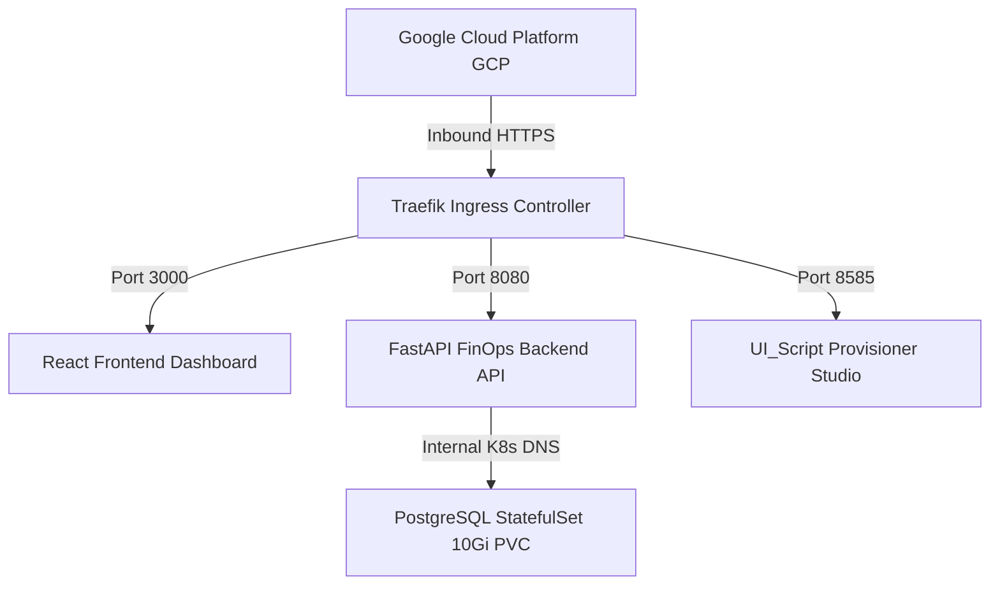

# 🔴 GCP GKE Deployment & FinOps Operations Guide

<p align="left">
  
  
  
  
  
</p>

This guide details the complete deployment, operations, and FinOps scanning pipeline for **GCP GKE (Google Kubernetes Engine)**.

---

## 🏗️ 3-Tier Microservice Architecture Stack



1. **📱 React Frontend Dashboard (`application/frontend`)**: Port `3000`
2. **⚙️ FastAPI Backend API (`application/backend`)**: Port `8080`
3. **🚀 UI_Script Provisioner Studio (`application/UI_Script`)**: Port `8585`

---

## 🚀 Quick Start & Local Execution

Launch the entire 3-service stack simultaneously from workspace root:
```bash
./start_local.sh
```

- **Backend API**: `http://localhost:8080`
- **Frontend Dashboard**: `http://localhost:3000`
- **UI_Script Provisioner**: `http://localhost:8585`

---

## 🛠️ GCP Multi-Cloud Infrastructure Provisioner

The platform includes an automated GCP resource provisioner script:
```bash
./script_to_create_Az/create_gcp_resources.sh --envs dev,qa,prd snapthreadz us-central1
```

Provisions 12 resources per environment in GCP:
- 🌐 VPC Network & Custom Subnet
- 🛡️ Firewall Rules
- 💻 Compute Engine VM (`e2-micro`)
- 🗄️ Cloud Storage Bucket
- 📊 Cloud Logging Sink
- 🚀 Cloud Run Service
- 🔐 Secret Manager Secret
- 📌 External Static IP Address
- 🔑 IAM Service Account
- 📈 Cloud Monitoring Metric
- 📦 Artifact Registry Repository

To tear down all resources:
```bash
./script_to_create_Az/create_gcp_resources.sh --destroy --envs dev,qa,prd snapthreadz us-central1
```

---

## 🐳 Dockerization & Kubernetes Deployment

- **UI_Script Dockerfile**: `application/UI_Script/Dockerfile`
- **Backend Dockerfile**: `application/backend/Dockerfile`
- **Frontend Dockerfile**: `application/frontend/Dockerfile`

### Helm Chart Deployment
```bash
helm upgrade --install finops ./chart \
  --namespace finops \
  --create-namespace \
  --set image.repository=us-central1-docker.pkg.dev/my-gcp-project/finops-repo \
  --set service.uiScriptPort=8585
```

---

## 🔄 CI/CD & GitOps Integration

- **GitHub Actions Pipeline**: `.github/workflows/ci-cd-gcp.yml` builds and pushes `backend`, `frontend`, and `ui_script` Docker images.
- **ArgoCD Application**: `argocd/application.yaml` continuously syncs `chart/` manifests to GCP GKE.
- **Prometheus Monitoring**: `chart/monitoring/servicemonitor-ui-script.yaml` monitors `ui_script` metrics on port `8585`.
